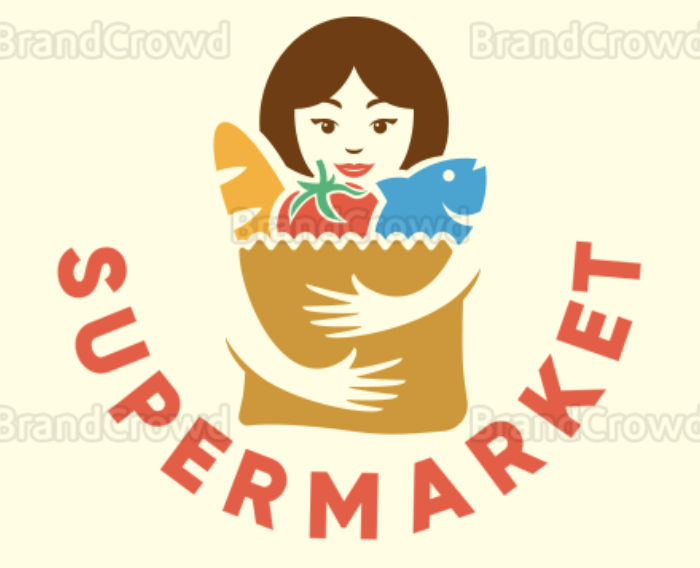

<div id="top"></div>

[![Contributors][contributors-shield]][contributors-url]
[![Forks][forks-shield]][forks-url]
[![Stargazers][stars-shield]][stars-url]
[![Issues][issues-shield]][issues-url]
[![MIT License][license-shield]][license-url]
[![LinkedIn][linkedin-shield]][linkedin-url]


<!-- PROJECT LOGO -->
<br />
<div align="center">
  <a href="https://github.com/jeffbum/supermarket-api">
    
  </a>

<h3 align="center">supermarket-api</h3>

  <p align="center">
    An API written in Golang to demostrate technical ability to write, document, and maintain an application.
    <br />
    <a href="https://github.com/jeffbum/supermarket-api/issues">Report Bug</a>
    ·
    <a href="https://github.com/jeffbum/supermarket-api/issues">Request Feature</a>
  </p>
</div>


<details>
  <summary>Table of Contents</summary>
  <ol>
    <li>
      <a href="#about-the-project">About The Project</a>
      <ul>
        <li><a href="#built-with">Built With</a></li>
      </ul>
    </li>
    <li>
      <ul>
        <li><a href="#prerequisites">Prerequisites</a></li>
        <li><a href="#installation">Installation</a></li>
        <li><a href="#run-locally">Run Locally</a></li>
        <li><a href="#run-in-docker-container">Run In Docker Container</a></li>
        <li><a href="#curl-commands">Curl Commands</a></li>
<p align="right">(<a href="#top">back to top</a>)</p>


### Built With

* [Golang](https://go.dev/)
* [gorilla/mux](https://pkg.go.dev/github.com/gorilla/mux)

<p align="right">(<a href="#top">back to top</a>)</p>

### Prerequisites

This is an example of how to list things you need to use the software and how to install them.
* Download [Golang](https://go.dev/dl/) if you're going to run this locally.
* Download [Docker](https://docs.docker.com/get-docker/)

### Installation

  Clone the repo
   ```sh
   git clone https://github.com/jeffbum/supermarket-api.git
   ```

### Run Locally

   ```sh
   go run main.go
   ```

### Run In Docker Container

```sh
   docker-compose up
   ```

<p align="right">(<a href="#top">back to top</a>)</p>

### Curl Commands
Here are curl commands you can run to hit available endpoints:
- GET all produce
  ```sh
   curl http://localhost:8080/api/v1/produce
   ```
- GET  produce by Id
  ```sh
   curl http://localhost:8080/api/v1/produce/L6M9-5P3N-Y5QR-LHEL
   ```
- POST create produce
  ```sh
   curl -X POST -H "Content-Type: application/json" \
    -d '{"produceCode": "QWE1-QWE2-QWE3-QWE4, "name": "Muffin", "unitPrice": 5.67}' \
    http://localhost:8080/api/v1/produce/
   ```
- DELETE produce by id
  ```sh
   curl -X DELETE http://localhost:8080/api/v1/produce/L6M9-5P3N-Y5QR-LHEL
   ```
## Roadmap

- Move handler functions to a Routes folder/package.
- Create API [documentation](https://github.com/swaggo/swag)
- Implement/Standardize Error types
    - Clean-up scan [failures](https://github.com/jeffbum/supermarket-api/runs/4720127691?check_suite_focus=true)

See the [open issues](https://github.com/jeffbum/supermarket-api/issues) for a full list of proposed features (and known issues).

<p align="right">(<a href="#top">back to top</a>)</p>

## License

Distributed under the MIT License. See `LICENSE.txt` for more information.

<p align="right">(<a href="#top">back to top</a>)</p>


## Contact

Jeff Bumgardner - <a href="mailto:bumgardner.jeffrey@gmail.com">bumgardner.jeffrey@gmail.com</a>

Project Link: [https://github.com/jeffbum/supermarket-api](https://github.com/jeffbum/supermarket-api)

<p align="right">(<a href="#top">back to top</a>)</p>

[contributors-shield]: https://img.shields.io/github/contributors/jeffbum/supermarket-api.svg?style=for-the-badge
[contributors-url]: https://github.com/jeffbum/supermarket-api/graphs/contributors
[forks-shield]: https://img.shields.io/github/forks/jeffbum/supermarket-api.svg?style=for-the-badge
[forks-url]: https://github.com/jeffbum/supermarket-api/network/members
[stars-shield]: https://img.shields.io/github/stars/jeffbum/supermarket-api.svg?style=for-the-badge
[stars-url]: https://github.com/jeffbum/supermarket-api/stargazers
[issues-shield]: https://img.shields.io/github/issues/jeffbum/supermarket-api.svg?style=for-the-badge
[issues-url]: https://github.com/jeffbum/supermarket-api/issues
[license-shield]: https://img.shields.io/github/license/jeffbum/supermarket-api.svg?style=for-the-badge
[license-url]: https://github.com/jeffbum/supermarket-api/blob/master/LICENSE.txt
[linkedin-shield]: https://img.shields.io/badge/-LinkedIn-black.svg?style=for-the-badge&logo=linkedin&colorB=555
[linkedin-url]: https://linkedin.com/in/jeff-bumgardner